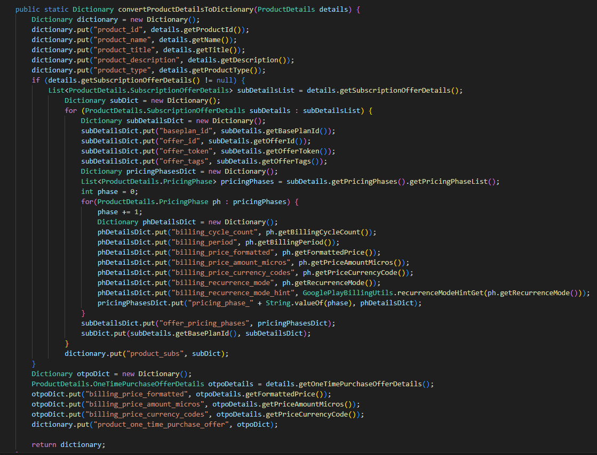

# godot-google-play-billing
Godot Android plugin for the Google Play Billing library

## What's new?
- upgrade sdk to 33
- upgrade billing from 5.2.1 to 6.1.0
- "rewrite" skuDetails to productDetails
- PriceChange was removed
- add Signal "feature_not_supported" when queryProductDetails fails


Modify by ALOBugTea.

## Usage & Docs
This version is difference with the official godot docs.
You can still find the docs for this first-party plugin and rebuild to the Godot 4.2.1 or other version, the version 5.2.1 is still accepting at google billing for a while. so, just check out the [official Godot docs](https://docs.godotengine.org/en/stable/tutorials/platform/android_in_app_purchases.html) and download it for stable version.
Therefore, I will put the new usage of own version explain.

### Why PriceChange was removed?
Basically, Google change the API, not longer to let the creator can handle notice of subscribe price change in app. They already removed at API supported.
Signal ``"price_change_acknowledged"`` was removed for this version.

### Initialize Change
Cause the change of ``PriceChange`` removed; Also, sku rewrite to product, so I changed some signal name to now

```
querySkuDetails -> queryProductDetails
sku_details_query_completed -> product_details_query_completed
```

### Initialize Example
```swift
var payment

func _ready():
	if Engine.has_singleton("GodotGooglePlayBilling"):
		payment = Engine.get_singleton("GodotGooglePlayBilling")

		# These are all signals supported by the API
		# You can drop some of these based on your needs
		payment.billing_resume.connect(_on_billing_resume) # No params
		payment.connected.connect(_on_connected) # No params
		payment.disconnected.connect(_on_disconnected) # No params
		payment.connect_error.connect(_on_connect_error) # Response ID (int), Debug message (string)
		payment.purchases_updated.connect(_on_purchases_updated) # Purchases (Dictionary[])
		payment.purchase_error.connect(_on_purchase_error) # Response ID (int), Debug message (string)
        payment.feature_not_supported.connect(_feature_not_supported) # No params, when query product details failed cause the feature not supported
		payment.product_details_query_completed.connect(_on_product_details_query_completed) # Products (Dictionary[])
		payment.product_details_query_error.connect(_on_product_details_query_error) # Response ID (int), Debug message (string), Queried product_Ids (string[])
		payment.purchase_acknowledged.connect(_on_purchase_acknowledged) # Purchase token (string)
		payment.purchase_acknowledgement_error.connect(_on_purchase_acknowledgement_error) # Response ID (int), Debug message (string), Purchase token (string)
		payment.purchase_consumed.connect(_on_purchase_consumed) # Purchase token (string)
		payment.purchase_consumption_error.connect(_on_purchase_consumption_error) # Response ID (int), Debug message (string), Purchase token (string)
		payment.query_purchases_response.connect(_on_query_purchases_response) # Purchases (Dictionary[])

		payment.startConnection()
	else:
		print("Android IAP support is not enabled. Make sure you have enabled 'Gradle Build' and the GodotGooglePlayBilling plugin in your Android export settings! IAP will not work.")
```

### Difference between skuDetails and productDetails
So... skuDetails was change a lot. I'm going to show what's change on usage.
### Query available items
before
```swift
func _on_connected():
  payment.querySkuDetails(["my_iap_item"], "inapp") # "subs" for subscriptions

func _on_sku_details_query_completed(product_details):
  for available_product in product_details:
	print(available_product)

func _on_sku_details_query_error(response_id, error_message, products_queried):
	print("on_sku_details_query_error id:", response_id, " message: ",
			error_message, " products: ", products_queried)
```
after
```swift
func _on_connected():
  payment.queryProductDetails(["my_iap_item"], "inapp") # "subs" for subscriptions

func _on_product_details_query_completed(product_details):
  for available_product in product_details:
	print(available_product)

func _on_product_details_query_error(response_id, error_message, products_queried):
	print("on_product_details_query_error id:", response_id, " message: ",
			error_message, " products: ", products_queried)
```
### Purchase fields changes
before
```swift
dictionary.put("order_id", purchase.getOrderId());
dictionary.put("package_name", purchase.getPackageName());
dictionary.put("purchase_state", purchase.getPurchaseState());
dictionary.put("purchase_time", purchase.getPurchaseTime());
dictionary.put("purchase_token", purchase.getPurchaseToken());
dictionary.put("quantity", purchase.getQuantity());
dictionary.put("signature", purchase.getSignature());
// PBL V4 replaced getSku with getSkus to support multi-sku purchases,
// use the first entry for "sku" and generate an array for "skus"
ArrayList<String> skus = purchase.getSkus();
dictionary.put("sku", skus.get(0)); # Not available in plugin
String[] skusArray = skus.toArray(new String[0]);
dictionary.put("products", productsArray);
dictionary.put("is_acknowledged", purchase.isAcknowledged());
dictionary.put("is_auto_renewing", purchase.isAutoRenewing());
```
after
```swift
dictionary.put("order_id", purchase.getOrderId());
dictionary.put("package_name", purchase.getPackageName());
dictionary.put("purchase_state", purchase.getPurchaseState());
dictionary.put("purchase_time", purchase.getPurchaseTime());
dictionary.put("purchase_token", purchase.getPurchaseToken());
dictionary.put("quantity", purchase.getQuantity());
dictionary.put("signature", purchase.getSignature());
List<String> products = purchase.getProducts();
dictionary.put("product", products.get(0)); //sku -> product
String[] productsArray = products.toArray(new String[0]);
dictionary.put("products", productsArray);
dictionary.put("is_acknowledged", purchase.isAcknowledged());
dictionary.put("is_auto_renewing", purchase.isAutoRenewing());
```
### Subscriptions change
Google was change the ``BillingFlowParams.ProrationMode`` to ``BillingFlowParams.SubscriptionUpdateParams.ReplacementMode``, the godot enum should change to this
```swift
enum SubscriptionReplacementMode {
    # The new plan takes effect immediately, and 
    # the remaining time will be prorated and credited to the user.
	WITH_TIME_PRORATION = 1,
    # The new plan takes effect immediately, and the billing cycle remains the same. 
    # The price for the remaining period will be charged. 
    # This option is only available for subscription upgrade.
    CHARGE_PRORATED_PRICE = 2,
    # The new plan takes effect immediately, and the new price 
    # will be charged on next recurrence time. The billing cycle stays the same.
    WITHOUT_PRORATION = 3,
    # The new plan takes effect immediately, and the user is charged full price of new plan and is 
    # given a full billing cycle of subscription, plus remaining prorated time from the old plan.
    CHARGE_FULL_PRICE = 5,
    # The new purchase takes effect immediately, 
    # the new plan will take effect when the old item expires.
    DEFERRED = 6
}
```
base on the new style enum, the example of use:
```swift
payment.updateSubscription(_active_subscription_purchase.purchase_token, 
											"new_subs_product_id", SubscriptionReplacementMode.WITH_TIME_PRORATION)
```

### Change of showing skuDetails to productDetails

simply have a same text at the begin, will easier to get some details... or not.


## Compiling

Prerequisites:

- Android SDK (platform version 33)
- the Godot Android library (`godot-lib.***.release.aar`) for your version of Godot from the [downloads page](https://godotengine.org/download).

Steps to build:

1. Clone this Git repository
2. Put `godot-lib.***.release.aar` in `./godot-google-play-billing/libs/`
3. Run `./gradlew build` in the cloned repository

If the build succeeds, you can find the resulting `.aar` files in `./godot-google-play-billing/build/outputs/aar/`.
